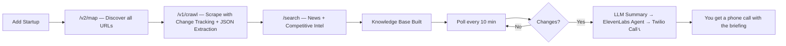

<div align="center">

# 🌍 ORBIT — The Startup Radio Globe

### *Hear the world's startups. Live intelligence, one globe.*

**Built for the [Firecrawl × ElevenLabs Hackathon](https://elevenlabs.io/hackathon)**

[](https://firecrawl.dev)
[](https://elevenlabs.io)
[](#)

<br />

https://github.com/user-attachments/assets/YOUR_DEMO_VIDEO_HERE

<br />

</div>

---

## 🎯 What is Orbit?

Orbit is a **real-time startup intelligence radio globe** that transforms web data into audio experiences. Click any startup on a 3D globe and instantly hear AI-generated debates, briefings, sentiment reports, and pricing analysis — all powered by **Firecrawl** for data and **ElevenLabs** for voice.

> **Imagine Bloomberg Terminal meets Spotify — but for startups, on a globe, with AI voices.**

### ✨ The Magic

1. 🌐 **Pick a startup** from 100+ live YC companies on a 3D globe
2. 🔥 **Firecrawl** crawls, scrapes, searches, and monitors their websites in real-time
3. 🎧 **ElevenLabs** turns that data into AI voice debates, phone calls, and briefings
4. 📞 **Twilio** calls your phone when a competitor's website changes

---

## 🔥 Firecrawl Usage — 7 Endpoints & Features

Orbit is one of the deepest integrations of the Firecrawl API. Every mode uses a different combination of endpoints:

| # | Firecrawl Feature | Where Used | What It Does |
|---|---|---|---|
| 1 | **`/v1/crawl`** | Story Mode, Competitor Watch | Deep-crawls startup websites (homepage, about, pricing, products) with `waitFor`, `actions` (scroll), and `JSON extraction` |
| 2 | **`/v1/scrape`** | Pricing, Research, Changes, Product Tracking | Scrapes individual pages with **Change Tracking** (`git-diff` mode) and structured JSON extraction |
| 3 | **`/v1/search`** (MCP) | Sentiment, Research, Story, Watch | Searches live news headlines, competitive intel, funding data, and counter-arguments via MCP Server |
| 4 | **`/v2/map`** | Competitor Watch | Maps entire domains to discover all URLs, then filters for relevant pages (pricing, about, products, blog) |
| 5 | **Change Tracking** | Competitor Watch, Changes Mode | Native `changeTracking` format with `git-diff` — detects real-time website changes with persistent server-side snapshots |
| 6 | **JSON Extraction** | Product Tracking, Watch | Structured data extraction with custom schemas (price, availability, rating, features) |
| 7 | **MCP Server** | All search operations | Firecrawl MCP Server for tool-based search integration |

### 🔥 Firecrawl Pipeline Architecture

```
Story Mode:    /crawl (full site) → /search (counter-arguments) → LLM → ElevenLabs TTS × 2 voices
Research Mode: /scrape (homepage) + /search ×3 (funding, competitors, news) → LLM → TTS briefing
Sentiment:     /search (news headlines) → LLM sentiment scoring → globe color mapping
Pricing:       /scrape (/pricing page) → JSON extraction → comparison table
Changes:       /scrape + changeTracking (git-diff) → detect changes → alert
Watch:         /map (discover URLs) → /crawl (with JSON schema) + /search ×2 → knowledge base → poll
Product:       /scrape (with JSON extraction: price, availability, rating) → alert conditions → phone call
```

---

## 🎧 ElevenLabs Usage — 6 Features

Every mode transforms Firecrawl data into a unique audio experience:

| # | ElevenLabs Feature | Where Used | What It Does |
|---|---|---|---|
| 1 | **Text to Speech** (Flash v2.5) | All modes | Two distinct AI voices (Alex & Sam) narrate debates, briefings, and summaries |
| 2 | **Text to Dialogue** | Story Mode | Generates 2-host AI debates with opposing viewpoints about each startup |
| 3 | **Conversational AI** | Call Mode, Phone Alerts | Creates real-time AI agents you can talk to — as a "founder" or for alert briefings |
| 4 | **Speech to Text** | Voice Commands, Call Mode | Transcribes user speech for voice navigation and interactive Q&A |
| 5 | **Sound Effects** | Changes Mode | Ambient industry-specific sounds (server hums, trading floors, nature) |
| 6 | **Text to Dialogue + Music** | Research Mode | Full audio briefings with background music for 60-second research reports |

### 🎧 Voice Pipeline

```
Firecrawl data → OpenRouter LLM (script generation) → ElevenLabs TTS (2 voices) → Browser audio
                                                     → ElevenLabs ConvAI (phone calls via Twilio WebSocket)
                                                     → ElevenLabs STT (voice commands)
```

---

## 🌐 The 6 Modes

<table>
<tr>
<td width="33%">

### 🎙 **Story**
*2-host AI debate about any startup*

**Firecrawl:** `/crawl` + `/search`
**ElevenLabs:** Text to Dialogue

Click a startup → hear two AI hosts debate its strengths and weaknesses with real data.

</td>
<td width="33%">

### 📞 **Call**
*Call the founder and ask anything*

**Firecrawl:** `/crawl` + `/search`
**ElevenLabs:** Conversational AI

Live interactive voice call with an AI-simulated founder powered by real website data.

</td>
<td width="33%">

### 📈 **Sentiment**
*Live news sentiment → globe colors*

**Firecrawl:** `/search`
**ElevenLabs:** Text to Speech

Globe markers glow green/red/white based on real-time news sentiment analysis.

</td>
</tr>
<tr>
<td width="33%">

### 💰 **Pricing**
*Compare live pricing pages*

**Firecrawl:** `/scrape`
**ElevenLabs:** Text to Speech

Scrapes actual pricing pages and extracts structured plan data for comparison.

</td>
<td width="33%">

### 🔴 **Changes**
*Website change detection*

**Firecrawl:** `/scrape` + Change Tracking
**ElevenLabs:** Sound Effects

Firecrawl's native change tracking with git-diff detects when startups update their sites.

</td>
<td width="33%">

### 🔍 **Research**
*60-second audio briefing*

**Firecrawl:** `/scrape` + `/search` ×3
**ElevenLabs:** Text to Dialogue + Music

Deep research with funding, competitors, news, risks — delivered as an audio report.

</td>
</tr>
</table>

---

## 👁 Competitor Watch System

The most advanced feature — a full competitive intelligence pipeline:



**What gets monitored per company:**
- 🏠 Homepage · 📋 About · 💰 Pricing · 📦 Products · 📰 News · 🎯 Competitive Intel

---

## 📦 Product Tracking

Track any e-commerce product with smart alerts:

- **Price drop alerts** — Get called when price drops below your threshold
- **Back-in-stock alerts** — Notified when products return to stock
- **Any change detection** — Price, rating, availability, features
- **Firecrawl JSON extraction** extracts structured product data automatically

---

## 🛠 Tech Stack

| Layer | Tech |
|---|---|
| **Data Intelligence** | 🔥 Firecrawl (`/crawl`, `/scrape`, `/search`, `/map`, Change Tracking, JSON Extraction, MCP) |
| **Voice & Audio** | 🎧 ElevenLabs (TTS, Conversational AI, STT, Sound Effects, Dialogue+Music) |
| **Phone Calls** | 📞 Twilio + ElevenLabs Conversational AI via WebSocket `<Connect><Stream>` |
| **AI/LLM** | 🧠 OpenRouter (Gemini Flash) for script generation, summarization, sentiment |
| **3D Globe** | 🌍 Three.js + react-globe.gl |
| **Frontend** | ⚛️ React 19 + Vite + TailwindCSS + Motion |
| **Backend** | 🟢 Express.js + TypeScript + WebSocket |
| **Live Data** | 📡 YC Startup data scraped via Firecrawl |

---

## 🚀 Quick Start

### Prerequisites
- Node.js 18+
- API Keys: Firecrawl, ElevenLabs, OpenRouter

### Setup

```bash
# Clone the repo
git clone https://github.com/RagavRida/orbit.git
cd orbit

# Install dependencies
npm install

# Configure API keys
cp .env.example .env.local
# Edit .env.local with your keys:
#   FIRECRAWL_API_KEY=your-key
#   ELEVENLABS_API_KEY=your-key
#   OPENROUTER_API_KEY=your-key

# Run the app
npm run dev
```

Open **http://localhost:3000** → click any startup on the globe → listen.

### For Phone Call Features (Optional)

```bash
# Add to .env.local:
TWILIO_ACCOUNT_SID=your-sid
TWILIO_AUTH_TOKEN=your-token
TWILIO_PHONE_NUMBER=+1234567890
USER_PHONE_NUMBER=+your-number

# Start ngrok for Twilio webhooks
ngrok http 3000 --domain=your-domain.ngrok-free.dev

# Update .env.local:
APP_URL=https://your-domain.ngrok-free.dev
```

---

## 📊 API Call Map

A single user session with Orbit can trigger:

| Action | Firecrawl Calls | ElevenLabs Calls |
|---|---|---|
| Story (2-host debate) | `/crawl` × 1, `/search` × 1 | TTS × 6-10 |
| Research briefing | `/scrape` × 1, `/search` × 3 | TTS × 4-6 |
| Sentiment check | `/search` × 1 | TTS × 1 |
| Pricing comparison | `/scrape` × 1 | TTS × 1 |
| Watch competitor | `/map` × 1, `/crawl` × 1, `/search` × 2 | ConvAI agent × 1 |
| Product track | `/scrape` × 1 (JSON extraction) | ConvAI agent × 1 |
| Change alert → call | — | ConvAI agent × 1 + Twilio WebSocket |

---

## 🏗 Architecture

```
┌──────────────────────────────────────────────────────────────┐
│                    ORBIT — Browser Client                     │
│  ┌─────────┐  ┌──────────┐  ┌──────────┐  ┌──────────────┐  │
│  │ 3D Globe│  │Radio     │  │WatchList │  │ Voice        │  │
│  │ Three.js│  │Panel     │  │Products  │  │ Commands     │  │
│  └────┬────┘  └────┬─────┘  └────┬─────┘  └──────┬───────┘  │
│       └────────────┴─────────────┴────────────────┘          │
│                          │ HTTP + SSE                         │
└──────────────────────────┼───────────────────────────────────┘
                           │
┌──────────────────────────┼───────────────────────────────────┐
│              Express.js + WebSocket Server                    │
│  ┌───────────────┐  ┌────────────────┐  ┌─────────────────┐ │
│  │ Firecrawl API │  │ ElevenLabs API │  │ Twilio + WS     │ │
│  │ /crawl /scrape│  │ TTS ConvAI STT │  │ <Stream> proxy  │ │
│  │ /search /map  │  │ Sound Effects  │  │ to ElevenLabs   │ │
│  │ + MCP Server  │  │                │  │ ConvAI          │ │
│  └───────────────┘  └────────────────┘  └─────────────────┘ │
└──────────────────────────────────────────────────────────────┘
```

---

## 🏆 Why Orbit Wins

| Criteria | Orbit's Strength |
|---|---|
| **Firecrawl Depth** | Uses 7 different Firecrawl features: `/crawl`, `/scrape`, `/search`, `/map`, Change Tracking, JSON Extraction, MCP Server |
| **ElevenLabs Depth** | Uses 6 different ElevenLabs features: TTS, Conversational AI, STT, Sound Effects, Dialogue, Music |
| **Integration** | Firecrawl data flows directly into ElevenLabs voices — every mode is a unique data→voice pipeline |
| **Real-time** | Live data from 100+ YC startups, polling, change detection, instant phone calls |
| **Product** | Not a toy — a genuine competitive intelligence tool with real utility |

---

## 👥 Team

Built by **Ragav Rida** — for the Firecrawl × ElevenLabs Hackathon 2025.

---

<div align="center">

### 🌍 *One globe. Six modes. Two APIs. Infinite intelligence.*

**[⭐ Star this repo](https://github.com/RagavRida/orbit)** · **[🔥 Firecrawl](https://firecrawl.dev)** · **[🎧 ElevenLabs](https://elevenlabs.io)**

</div>
